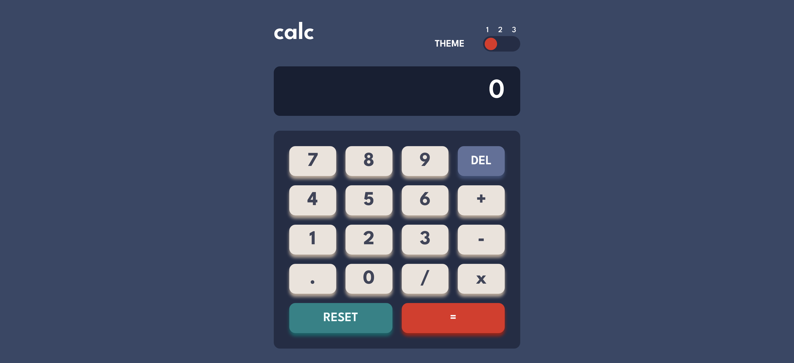
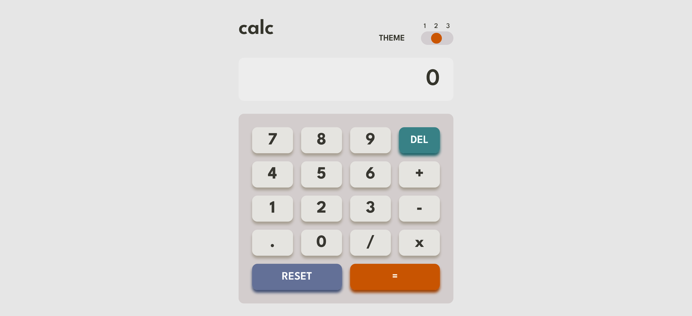
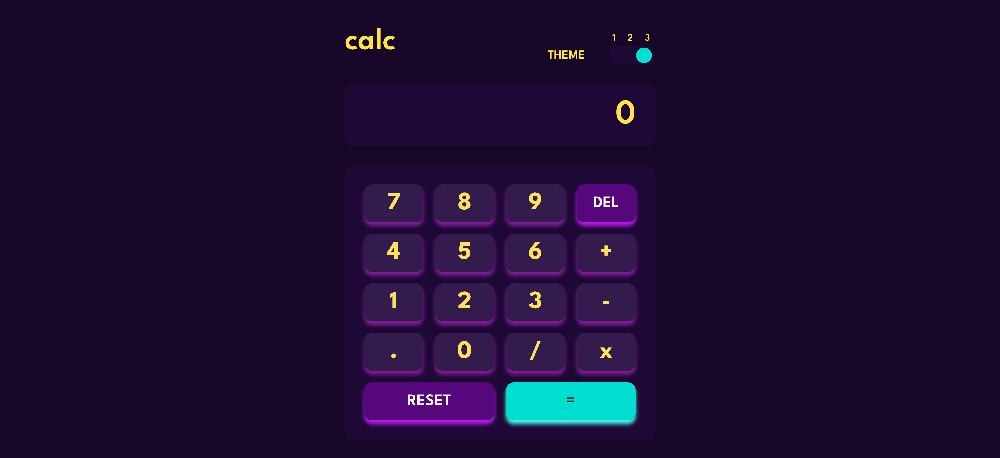

# Frontend Mentor - Calculator app solution

This is a solution to the [Calculator app challenge on Frontend Mentor](https://www.frontendmentor.io/challenges/calculator-app-9lteq5N29).

## Overview

### The challenge

Users should be able to:

- See the size of the elements adjust based on their device's screen size
- Perform mathmatical operations like addition, subtraction, multiplication, and division
- Adjust the color theme based on their preference

### Screenshot
Theme1:

Theme2:

Theme3:



### Links

- Solution URL: [https://github.com/liliaferrouk/Calculator-app](https://github.com/liliaferrouk/Calculator-app)
- Live Site URL: [https://liliaferrouk.github.io/Calculator-app/](https://liliaferrouk.github.io/Calculator-app/)

## My process

### Built with

- Semantic HTML5 markup
- CSS custom properties
- Flexbox
- CSS Grid
- Mobile-first workflow
- [React](https://reactjs.org/) - JS library


### What I learned

1. **Dynamic CSS Classes**
    - I learned how to dynamically set CSS classes based on the value of a variable. For example:
    ```javascript
    const headerClass = `header-theme${theme}`;
    return (
        <header className={headerClass}>
            {/* Other header content */}
        </header>
    );
    ```

2. **Dynamic Body Background Color**
    - I learned how to change the background color of the body based on the theme value:
    ```javascript
    const [theme,setTheme] = useState(1)
    const themes = {
        1: {
        backgroundColor: 'hsl(222, 26%, 31%)',
        },
        2: {
        backgroundColor: 'hsl(0, 0%, 90%)',
        },
        3: {
        backgroundColor: 'hsl(268, 75%, 9%)',
        },
    }
    useEffect(() => {
        document.body.style.backgroundColor = themes[theme].backgroundColor;
    }, [theme]);
    ```

3. **Detecting and Alerting for Browser Compatibility**
    - I learned how to force the browser to use my CSS rules even in dark mode and how to alert the user if the browser they're using may not support something:
    ```javascript
    useEffect(() => {
        if (navigator.userAgent.match(/samsung/i)) {
            alert(
                "Your browser (Samsung Internet) may not show this website" +
                " correctly. Please consider using a standards-compliant" +
                " browser instead. \n\n" +
                "We recommend Firefox, Microsoft Edge, or Google Chrome."
            );
        }
    }, []);
    ```


## Author

- Frontend Mentor - [@liliaferrouk](https://www.frontendmentor.io/profile/liliaferrouk)
